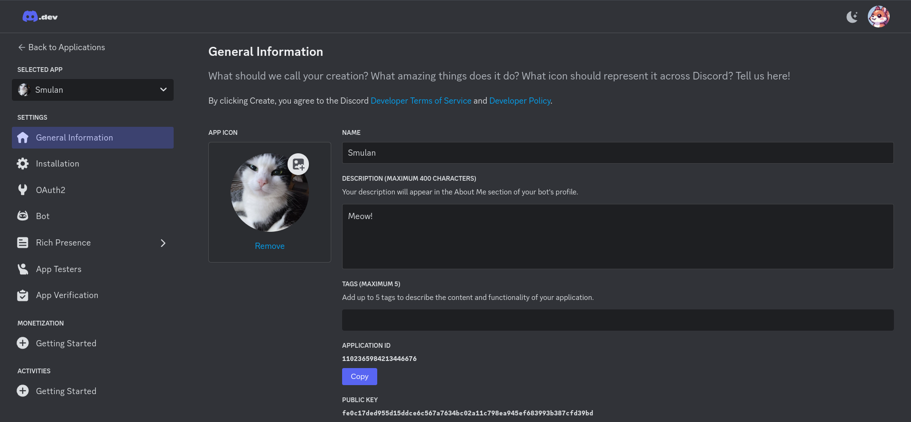
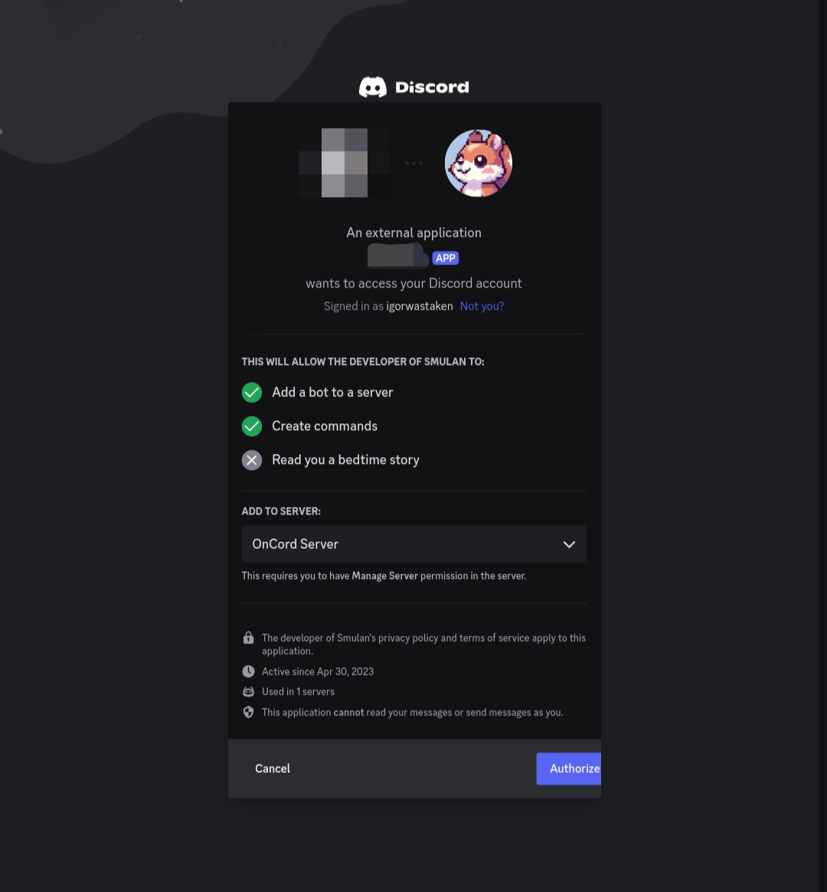

## Firsts steps
1. Go to [Discord Developer Portal](https://discord.com/developers) and login your account.
2. Click on the button "New Application"
3. Name your application, click on the checkbox, then click "Create".

Now, you'll see this page:

## Second step
Now, add your bot to any server that you or someone else created.
1. Go to OAuth2 (on your bot page)
2. Scroll down and find *OAuth2 URL Generator*
3. Select the scopes `bot` and `applications.commands`
4. Scroll down again, and you see that you can select your bot permissions. If you scroll down more, you will see the bot's Invite URL, then copy it, and paste on your browser.

## Third step
After the second step, you'll see this page:

Add that bot to your favorite server, and 🎉! You created your first bot application!

## Bot token
Firstly, we want to comment on the security of your bot token.
Do not leave your token exposed anywhere, this can result in several problems, such as hacking, unauthorized access by other people to your bot account.Leaving the token exposed could even result in the suspension of your Discord account.
For more info, read [this article of Discord.js](https://discordjs.guide/creating-your-bot/#using-environment-variables) about how to avoid that your token got leaked.