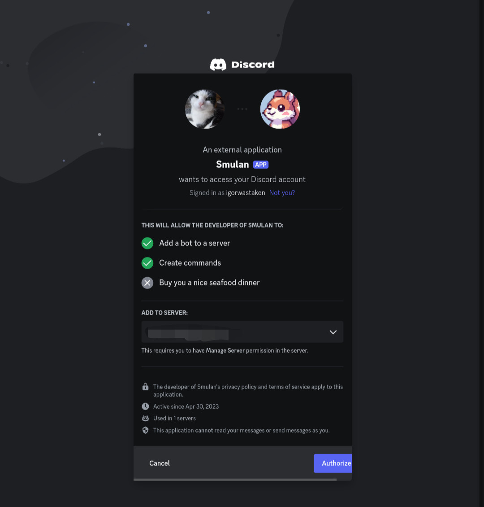

## Getting Started

1. Go to the [Discord Developer Portal](https://discord.com/developers) and log in to your account.
2. Click the "New Application" button.
3. Name your application, agree to the terms by checking the box, and then click "Create".

You will be redirected to this page:

## Adding your Bot to a Server

1. Navigate to the OAuth2 section on your bot's page.
2. Scroll down to find the *OAuth2 URL Generator*.
3. Select the scopes `bot` and `applications.commands`.
4. Scroll down further to select your bot's permissions. Continue scrolling to find the bot's Invite URL. Copy this URL and paste it into your browser.

## Inviting Your Bot

After completing the previous steps, you will see this page:

Invite your bot to your desired server and that's it! You've created your first bot application and invited it!

## Bot Token Security

It's crucial to keep your bot token secure. Exposing your token can lead to your bot being compromised. This exposure can even result in the suspension of your Discord account. For more information on securing your token, read this [article](https://discordjs.guide/creating-your-bot/#using-environment-variables) on how to prevent token leaks.
